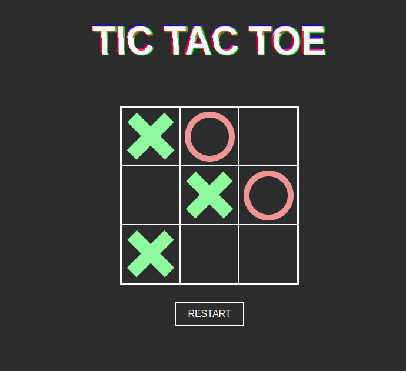
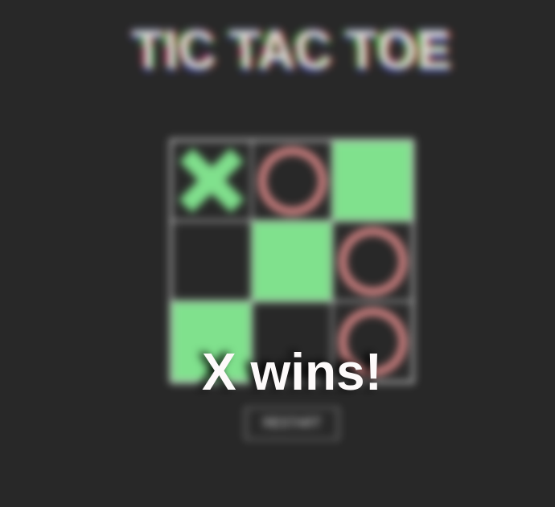

This project showacases a web-based implementation of Tic Tac Toe game, created using JavaScript, HTML and CSS. 
<h2><a href="https://kawalae.github.io/Tic-Tac-Toe/">Click here to view!</a></h2>

<h2><strong>Technologies used</strong></h2>

</img>
</img>
</img>
</img>

 
<h2><strong>Project description</strong></h2>
 

</img>

</img>

<h2><strong>Acknowledgements</strong></h2>
<ul>
    <li><a href="https://www.youtube.com/watch?v=7Xyg8Ja7dyY">Create glitch effect - tutorial by Kevin Powell</a></li>
    <li><a target="_blank" href="https://icons8.com/icon/aMgyX68CgyLu/tic-tac-toe">Tic Tac Toe</a> icon by <a target="_blank" href="https://icons8.com">Icons8</a></li>

</ul>
